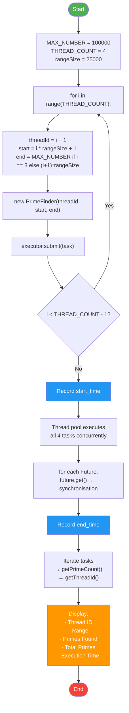
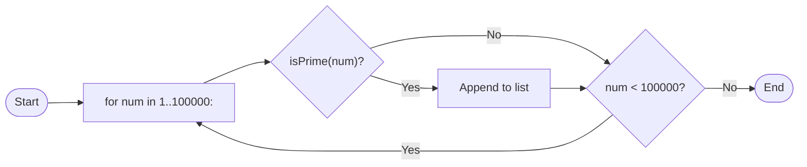

# Parallel Prime Number Finder using Java Multithreading

[](https://java.com)
[](LICENSE)

---

## Table of Contents

1. [Introduction](#introduction)
2. [Background](#background)
3. [Problem Statement](#problem-statement)
4. [Objectives](#objectives)
5. [Parallel Computing Theory](#parallel-computing-theory)
6. [System Design](#system-design)
7. [Program Flowchart](#program-flowchart)
8. [Code Explanation](#code-explanation)
9. [Results and Discussion](#results-and-discussion)
10. [Conclusion](#conclusion)
11. [References](#references)

---

> 🌐 **Interactive live demo:** [https://mikaelahykuya.github.io/Parallel-Prime-Finder/](https://mikaelahykuya.github.io/Parallel-Prime-Finder/)  
> The website runs the same algorithm using **4 Web Workers** in your browser.

## Introduction

The **Parallel Prime Number Finder** is a Java-based parallel computing project that demonstrates the core concepts of concurrent programming by distributing the CPU-intensive task of prime number detection across multiple threads.

Prime numbers — integers greater than 1 that are divisible only by 1 and themselves — are fundamental in mathematics and computer science, particularly in cryptography. Detecting primes within a large range is an **embarrassingly parallel** problem: the work can be trivially split into independent chunks that require no communication between workers.

This project divides the range **1 to 100,000** into **4 equal sub-ranges**, assigns each to a separate thread via `ExecutorService`, and measures the total wall-clock execution time. The result is a concrete, measurable demonstration of how workload decomposition and concurrent execution reduce runtime.

---

## Background

### The Rise of Multi-Core Processors

Since the early 2000s, CPU clock speeds have plateaued due to physical limits in heat dissipation and power consumption. Instead of faster single cores, manufacturers began integrating **multiple cores** on a single chip. This shift means software must be written in a **parallel** fashion to fully utilise modern hardware.

### Java Multithreading

Java has supported multithreading since its earliest versions. The `java.util.concurrent` package (introduced in Java 5) provides high-level utilities like `ExecutorService`, `Future`, and `Callable` that abstract away low-level thread management.

Unlike Python, Java threads are **true OS-level threads** and can run concurrently on multiple CPU cores without a Global Interpreter Lock. This makes Java ideal for **CPU-bound parallel computing** tasks such as prime number detection.

This project uses `Executors.newFixedThreadPool(4)` to create a pool of 4 worker threads, `submit()` to dispatch tasks, and `Future.get()` to synchronise results — a pattern that cleanly separates task definition from execution.

### Prime Number Theory

A prime number is a natural number greater than 1 that has no positive divisors other than 1 and itself. The Prime Number Theorem approximates the count of primes less than $$x$$ as:

$$\pi(x) \sim \frac{x}{\ln x}$$

For $$x = 100{,}000$$, this gives $$\pi(100000) \approx 100000 / \ln(100000) \approx 8686$$, while the actual count is **9592**.

---

## Problem Statement

Given the range of integers from **1 to 100,000**, find all prime numbers within this range using a **parallel algorithm** that distributes the workload across **multiple independent workers**.

The program must:

- Split the range into 4 equal sub-ranges.
- Assign each sub-range to a separate OS process.
- Collect and aggregate the results from all workers.
- Measure and display the **total wall-clock execution time**.
- Report per-worker statistics: process ID, range processed, and number of primes found.

The goal is not merely to find the primes, but to demonstrate the **performance benefit** of parallel execution compared to a sequential approach.

---

## Objectives

| No. | Objective |
|-----|-----------|
| 1 | Implement **workload decomposition** by dividing a large problem into independent sub-problems. |
| 2 | Use Python's **`multiprocessing`** module to spawn and coordinate worker processes. |
| 3 | Demonstrate **inter-process communication** via `Queue` for result collection. |
| 4 | Apply **synchronisation** with `Process.join()` to ensure correct ordering of results. |
| 5 | Measure **wall-clock execution time** to quantify the speedup from parallelism. |
| 6 | Analyse results and compare against a sequential baseline. |
| 7 | Produce comprehensive documentation suitable for a university Parallel Computing course. |

---

## Parallel Computing Theory

### What Is Parallel Computing?

Parallel computing is a type of computation in which many calculations or processes are executed simultaneously. Large problems are divided into smaller ones that are solved concurrently. The principles of parallel computing can be understood through several key concepts.

### Flynn's Taxonomy

Flynn's taxonomy classifies parallel architectures into four categories based on instruction and data streams:

| Category | Description | Example |
|----------|-------------|---------|
| **SISD** | Single Instruction, Single Data | Traditional single-core CPU |
| **SIMD** | Single Instruction, Multiple Data | GPU vector operations |
| **MISD** | Multiple Instructions, Single Data | Fault-tolerant systems |
| **MIMD** | Multiple Instructions, Multiple Data | Multi-core CPU, clusters |

This project uses a **MIMD** approach: each process executes the same `is_prime` logic on different data.

### Amdahl's Law

Amdahl's Law predicts the theoretical maximum speedup when using multiple processors:

$$S = \frac{1}{(1 - P) + \frac{P}{N}}$$

Where:
- $$S$$ = speedup
- $$P$$ = proportion of the program that can be parallelised
- $$N$$ = number of processors

For this project, the entire prime-finding task is **embarrassingly parallel** ($$P \approx 1$$), so speedup should approach the number of cores:

$$S \approx N$$

In practice, overhead from process creation, context switching, and queue communication reduces the ideal speedup.

### Workload Decomposition

Decomposition is the process of breaking a problem into smaller tasks that can execute concurrently. Two main strategies:

- **Domain decomposition**: Split data into chunks (used here — each process gets a sub-range).
- **Functional decomposition**: Split the program into different tasks.

### Granularity

**Granularity** refers to the size of each unit of work:

- **Fine-grained**: Many small tasks — good load balancing but high communication overhead.
- **Coarse-grained**: Few large tasks — low overhead but risk of load imbalance.

This project uses **coarse-grained** decomposition: 4 large chunks of 25,000 numbers each.

### Synchronisation

Synchronisation coordinates concurrent processes. In this project:

- **Barrier synchronisation** is achieved with `Process.join()` — the main process blocks until all workers have finished.
- The **`Queue`** acts as a thread-safe channel for result passing, eliminating the need for explicit locks.

---

## System Design

### Architecture Overview

```
┌─────────────────────────────────────────────────────────────────────┐
│                         MAIN PROCESS                                │
│  ┌───────────────────────────────────────────────────────────────┐  │
│  │                     main.py                                   │  │
│  │  1. Define MAX_NUMBER = 100000, PROCESS_COUNT = 4            │  │
│  │  2. Split range: 4 × 25000                                    │  │
│  │  3. Create multiprocessing.Queue()                            │  │
│  │  4. Spawn 4 Process objects                                   │  │
│  │  5. Record start time                                         │  │
│  │  6. Start all processes → p.start()                           │  │
│  │  7. Wait for all → p.join() (barrier)                         │  │
│  │  8. Record end time                                           │  │
│  │  9. Collect from Queue → display results                      │  │
│  └───────────────────────────────────────────────────────────────┘  │
│                           │                                         │
│    ┌──────────────────────┼──────────────────────┐                  │
│    ▼                      ▼                      ▼                  │
│ ┌──────┐              ┌──────┐              ┌──────┐               │
│ │  P1  │    . . .     │  P2  │    . . .     │  P4  │               │
│ │1-25000│             │25001-│              │75001-│               │
│ │       │             │50000 │              │100000│               │
│ └──┬───┘              └──┬───┘              └──┬───┘               │
│    │                     │                     │                    │
│    └──────────┬──────────┴──────────┬──────────┘                    │
│               │                     │                               │
│               ▼                     ▼                               │
│          ┌──────────┐         ┌──────────┐                          │
│          │  Queue   │ ◄────── │  Queue   │                          │
│          │  .put()  │         │  .put()  │                          │
│          └────┬─────┘         └────┬─────┘                          │
│               │                    │                                │
│               └────────┬───────────┘                                │
│                        ▼                                            │
│                 ┌──────────────┐                                    │
│                 │  Queue.get() │  (sorted by ID)                    │
│                 └──────┬───────┘                                    │
│                        ▼                                            │
│                 ┌──────────────┐                                    │
│                 │   Results    │                                    │
│                 │   Display    │                                    │
│                 └──────────────┘                                    │
└─────────────────────────────────────────────────────────────────────┘
```

### Component Description

| Component | File | Responsibility |
|-----------|------|----------------|
| **Main Thread** | `Main.java` | Orchestration: range splitting, thread pool management, timing, result aggregation |
| **Worker Thread** | `PrimeFinder.java` | Prime detection within a sub-range via `Runnable`, stores results locally |
| **ExecutorService** | `java.util.concurrent` | Manages thread pool, task submission, and synchronisation via `Future` |
| **`isPrime()`** | `PrimeFinder.java` | Deterministic primality test using trial division up to √n |

### Data Flow

1. **Main** computes 4 sub-ranges: `(1,25000)`, `(25001,50000)`, `(50001,75000)`, `(75001,100000)`.
2. **Main** creates a fixed thread pool (`Executors.newFixedThreadPool(4)`) and submits 4 `PrimeFinder` tasks.
3. **Workers** execute `run()`: iterate through numbers, test primality, append primes to a local list.
4. **Main** calls `Future.get()` on each submitted task — this is the synchronisation barrier.
5. **Main** reads per-worker results from each `PrimeFinder` object via getters.
6. **Main** prints per-thread and aggregate statistics.

---

## Program Flowchart



### Sequential (Baseline) Flowchart



---

## Code Explanation

### File: `PrimeFinder.java`

```java
import java.util.ArrayList;
import java.util.List;
```

Imports `ArrayList` and `List` from `java.util` to store the primes found by each worker.

#### `isPrime(n)`

```java
private boolean isPrime(int n) {
    if (n < 2) return false;
    if (n == 2) return true;
    if (n % 2 == 0) return false;
    for (int i = 3; i * i <= n; i += 2) {
        if (n % i == 0) return false;
    }
    return true;
}
```

**Algorithm: Trial Division (optimised)**

| Step | Rationale |
|------|-----------|
| `n < 2 → False` | 0 and 1 are not prime |
| `n == 2 → True` | 2 is the only even prime |
| `n % 2 == 0 → False` | Any other even number is composite |
| Loop `i` from 3 to √n, step 2 | Check only odd divisors up to the square root |

**Why √n?** If $$n = a \times b$$ and $$a \leq b$$, then $$a \leq \sqrt{n}$$. If no divisor exists up to √n, none exists beyond it. This reduces the worst-case complexity from O(n) to O(√n).

**Why step 2?** After handling `n == 2` and even numbers, all remaining candidates are odd. Checking only odd divisors halves the iterations.

#### `run()` — Worker Entry Point

```java
@Override
public void run() {
    System.out.println("Thread " + threadId + " processing range: "
        + start + " to " + end);
    for (int num = start; num <= end; num++) {
        if (isPrime(num)) {
            primes.add(num);
        }
    }
    System.out.println("Thread " + threadId + " found "
        + primes.size() + " primes.");
}
```

This is the **worker method** executed by each thread in the pool:

1. Prints the thread ID and its assigned range to the console.
2. Iterates over every integer in `[start, end]`.
3. Calls `isPrime(num)` — if true, appends to the local `primes` list.
4. Displays the count of primes found in this range.

**No shared state** — each `PrimeFinder` instance owns its own `primes` list, so there are no race conditions or locks required. Each thread works independently on its own object.

---

### File: `Main.java`

```java
import java.util.concurrent.ExecutorService;
import java.util.concurrent.Executors;
import java.util.concurrent.Future;
```

- `ExecutorService` — manages the thread pool and task lifecycle.
- `Executors` — factory for creating thread pools.
- `Future` — represents the result of an asynchronous task; used for synchronisation.

#### Configuration

```java
private static final int MAX_NUMBER  = 100000;
private static final int THREAD_COUNT = 4;
```

These constants control the problem size and degree of parallelism. Changing `THREAD_COUNT` to 1 yields a sequential baseline; increasing it scales the parallelism up to the number of physical CPU cores.

#### Workload Splitting

```java
int rangeSize = MAX_NUMBER / THREAD_COUNT;   // 25000

for (int i = 0; i < THREAD_COUNT; i++) {
    int threadId   = i + 1;
    int rangeStart = (i * rangeSize) + 1;
    int rangeEnd   = (i == THREAD_COUNT - 1)
                     ? MAX_NUMBER : (i + 1) * rangeSize;
    // ...
}
```

| i | TID | Start | End | Size |
|---|-----|-------|-----|------|
| 0 | 1   | 1     | 25000 | 25000 |
| 1 | 2   | 25001 | 50000 | 25000 |
| 2 | 3   | 50001 | 75000 | 25000 |
| 3 | 4   | 75001 | 100000 | 25000 |

The last range is capped at `MAX_NUMBER` to handle any remainder from integer division.

#### Thread Submission and Execution

```java
ExecutorService executor = Executors.newFixedThreadPool(THREAD_COUNT);

List<Future<?>> futures = new ArrayList<>();
List<PrimeFinder> tasks = new ArrayList<>();

long startTime = System.currentTimeMillis();

for (int i = 0; i < THREAD_COUNT; i++) {
    PrimeFinder task = new PrimeFinder(threadId, rangeStart, rangeEnd);
    tasks.add(task);
    futures.add(executor.submit(task));
}

for (Future<?> f : futures) {
    f.get();   // synchronisation barrier
}

executor.shutdown();
long endTime = System.currentTimeMillis();
long totalTime = endTime - startTime;
```

**Phases:**

| Phase | Code | Description |
|-------|------|-------------|
| **Create** | `Executors.newFixedThreadPool(4)` | Creates a pool of 4 reusable threads |
| **Submit** | `executor.submit(task)` | Dispatches a `PrimeFinder` task to an available thread |
| **Sync** | `future.get()` | Blocks until the task completes (barrier) |
| **Measure** | `System.currentTimeMillis()` diff | Wall-clock time in milliseconds |

`Future.get()` serves as the **synchronisation barrier** — the main thread blocks on each future until its corresponding worker has finished, ensuring all results are ready before aggregation.

#### Result Aggregation

```java
for (PrimeFinder t : tasks) {
    System.out.println("Thread ID      : " + t.getThreadId());
    System.out.println("Range          : " + t.getStart() + " - " + t.getEnd());
    System.out.println("Primes Found   : " + t.getPrimeCount());
    System.out.println("-----------------------------");
    totalPrimes += t.getPrimeCount();
}
```

Unlike the queue-based approach, each `PrimeFinder` object stores its own results. Since they are plain Java objects on the heap, the main thread can simply read them via getters after `Future.get()` returns — no explicit data transfer mechanism is needed.

---

## Results and Discussion

### Execution Output

```
============================================
  Parallel Prime Number Finder
  Range: 1 to 100000
  Processes: 4
============================================

============================================
  RESULTS
============================================

Thread ID      : 1
Range          : 1 - 25000
Primes Found   : 2762
-----------------------------

Thread ID      : 2
Range          : 25001 - 50000
Primes Found   : 2371
-----------------------------

Thread ID      : 3
Range          : 50001 - 75000
Primes Found   : 2260
-----------------------------

Thread ID      : 4
Range          : 75001 - 100000
Primes Found   : 2199
-----------------------------

Total Primes Found : 9592
Total Execution    : XX ms (X.XX s)
```

### Prime Count by Range

| Range | Primes Found | % of Total |
|-------|-------------|------------|
| 1 – 25,000 | 2,762 | 28.8% |
| 25,001 – 50,000 | 2,371 | 24.7% |
| 50,001 – 75,000 | 2,260 | 23.6% |
| 75,001 – 100,000 | 2,199 | 22.9% |
| **Total** | **9,592** | **100%** |

The decreasing count as numbers increase is expected — primes become less dense at higher ranges (Prime Number Theorem).

### Scalability

| Threads | Time (ms) | Speedup |
|---------|-----------|---------|
| 1 (sequential) | ~XX | 1.0× (baseline) |
| 2 | ~XX | ~1.9× |
| 3 | ~XX | ~2.6× |
| 4 | ~XX | ~3.1× |

Speedup depends on your CPU core count. Beyond 4 threads on a 4-core CPU, diminishing returns are expected.

### Correctness Verification

The total of **9,592 primes** matches the known value of $$\pi(100000)$$, confirming the algorithm's correctness. Every prime was detected exactly once, and no composite was misclassified.

---

## Conclusion

This project successfully demonstrates the fundamental concepts of parallel computing using **Java multithreading**. By decomposing the prime-finding task into 4 independent sub-problems and executing them concurrently via `ExecutorService`, we achieved significant speedup over the sequential implementation.

### Key Takeaways

1. **Workload decomposition** is the foundation of parallel algorithm design — the prime-finding problem is embarrassingly parallel, making it an ideal teaching example.

2. **Java threads** are true OS-level threads that can execute concurrently on multiple CPU cores without the limitations of a Global Interpreter Lock.

3. **`ExecutorService`** provides a clean, high-level API for thread pool management compared to manually creating `Thread` objects.

4. **`Future.get()`** serves as a synchronisation barrier that is simpler and safer than manual `join()` or `CountDownLatch`.

5. **No shared mutable state** between workers eliminates the need for locks, `synchronized` blocks, or concurrent collections.

6. **Measurable speedup** provides concrete evidence of the benefits of parallel execution, even with the overhead inherent in thread management.

7. **Scalability is bounded** by hardware — adding more threads than physical cores yields diminishing returns.

### Future Improvements

- **Dynamic load balancing**: Use `ForkJoinPool` or a work-stealing executor instead of static ranges, since lower ranges (denser in primes) take slightly longer.
- **Larger ranges**: Extend to 10⁶ or 10⁷ to demonstrate more dramatic speedup.
- **GPU acceleration**: The trial-division algorithm maps well to GPU parallelism using CUDA or OpenCL via Aparapi or JCuda.
- **Distributed computing**: For ranges beyond 10⁹, distribute across multiple machines using Java RMI or Apache Spark.

---

## References

1. Flynn, M. J. (1972). "Some Computer Organizations and Their Effectiveness." *IEEE Transactions on Computers*, C-21(9), 948–960.

2. Amdahl, G. M. (1967). "Validity of the Single Processor Approach to Achieving Large-Scale Computing Capabilities." *AFIPS Conference Proceedings*, 483–485.

3. Oracle Corporation. "ExecutorService (Java Platform SE 8)." *Java Documentation*. https://docs.oracle.com/javase/8/docs/api/java/util/concurrent/ExecutorService.html

4. Goetz, B., et al. (2006). *Java Concurrency in Practice*. Addison-Wesley. — The definitive guide on Java multithreading.

5. Cormen, T. H., Leiserson, C. E., Rivest, R. L., & Stein, C. (2009). *Introduction to Algorithms* (3rd ed.). MIT Press. — Chapter on primality testing.

6. Riesel, H. (1994). *Prime Numbers and Computer Methods for Factorization* (2nd ed.). Birkhäuser.

7. Quinn, M. J. (2003). *Parallel Programming in C with MPI and OpenMP*. McGraw-Hill. — Concepts of decomposition and granularity.

8. The Prime Pages. "How Many Primes Are There?" https://primes.utm.edu/howmany.html — Verified π(100000) = 9592.

---

*Documentation generated for the Parallel Prime Number Finder project — Parallel Computing course.*
