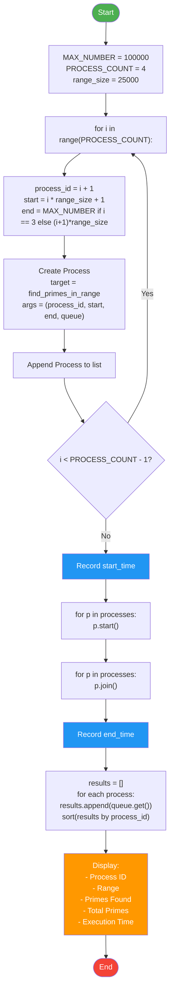
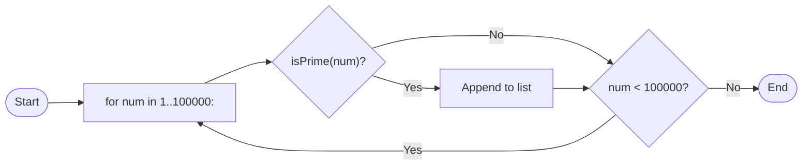

# Parallel Prime Number Finder using Multiprocessing

[](https://python.org)
[](LICENSE)

---

## Table of Contents

1. [Introduction](#introduction)
2. [Background](#background)
3. [Problem Statement](#problem-statement)
4. [Objectives](#objectives)
5. [Parallel Computing Theory](#parallel-computing-theory)
6. [System Design](#system-design)
7. [Program Flowchart](#program-flowchart)
8. [Code Explanation](#code-explanation)
9. [Results and Discussion](#results-and-discussion)
10. [Conclusion](#conclusion)
11. [References](#references)

---

## Introduction

The **Parallel Prime Number Finder** is a Python-based parallel computing project that demonstrates the core concepts of concurrent programming by distributing the CPU-intensive task of prime number detection across multiple operating system processes.

Prime numbers — integers greater than 1 that are divisible only by 1 and themselves — are fundamental in mathematics and computer science, particularly in cryptography. Detecting primes within a large range is an **embarrassingly parallel** problem: the work can be trivially split into independent chunks that require no communication between workers.

This project divides the range **1 to 100,000** into **4 equal sub-ranges**, assigns each to a separate Python `Process`, and measures the total wall-clock execution time. The result is a concrete, measurable demonstration of how workload decomposition and concurrent execution reduce runtime.

---

## Background

### The Rise of Multi-Core Processors

Since the early 2000s, CPU clock speeds have plateaued due to physical limits in heat dissipation and power consumption. Instead of faster single cores, manufacturers began integrating **multiple cores** on a single chip. This shift means software must be written in a **parallel** fashion to fully utilise modern hardware.

### Python and the GIL

Python's reference implementation (CPython) includes a **Global Interpreter Lock (GIL)**, which allows only one thread to execute Python bytecode at a time. For **CPU-bound** tasks — those that spend most of their time performing computations rather than waiting for I/O — the `threading` module provides **no speedup** and can even degrade performance due to context-switching overhead.

The `multiprocessing` module circumvents the GIL by spawning **separate OS processes**, each with its own Python interpreter and memory space. This enables **true parallel execution** on multiple cores.

### Prime Number Theory

A prime number is a natural number greater than 1 that has no positive divisors other than 1 and itself. The Prime Number Theorem approximates the count of primes less than $$x$$ as:

$$\pi(x) \sim \frac{x}{\ln x}$$

For $$x = 100{,}000$$, this gives $$\pi(100000) \approx 100000 / \ln(100000) \approx 8686$$, while the actual count is **9592**.

---

## Problem Statement

Given the range of integers from **1 to 100,000**, find all prime numbers within this range using a **parallel algorithm** that distributes the workload across **multiple independent workers**.

The program must:

- Split the range into 4 equal sub-ranges.
- Assign each sub-range to a separate OS process.
- Collect and aggregate the results from all workers.
- Measure and display the **total wall-clock execution time**.
- Report per-worker statistics: process ID, range processed, and number of primes found.

The goal is not merely to find the primes, but to demonstrate the **performance benefit** of parallel execution compared to a sequential approach.

---

## Objectives

| No. | Objective |
|-----|-----------|
| 1 | Implement **workload decomposition** by dividing a large problem into independent sub-problems. |
| 2 | Use Python's **`multiprocessing`** module to spawn and coordinate worker processes. |
| 3 | Demonstrate **inter-process communication** via `Queue` for result collection. |
| 4 | Apply **synchronisation** with `Process.join()` to ensure correct ordering of results. |
| 5 | Measure **wall-clock execution time** to quantify the speedup from parallelism. |
| 6 | Analyse results and compare against a sequential baseline. |
| 7 | Produce comprehensive documentation suitable for a university Parallel Computing course. |

---

## Parallel Computing Theory

### What Is Parallel Computing?

Parallel computing is a type of computation in which many calculations or processes are executed simultaneously. Large problems are divided into smaller ones that are solved concurrently. The principles of parallel computing can be understood through several key concepts.

### Flynn's Taxonomy

Flynn's taxonomy classifies parallel architectures into four categories based on instruction and data streams:

| Category | Description | Example |
|----------|-------------|---------|
| **SISD** | Single Instruction, Single Data | Traditional single-core CPU |
| **SIMD** | Single Instruction, Multiple Data | GPU vector operations |
| **MISD** | Multiple Instructions, Single Data | Fault-tolerant systems |
| **MIMD** | Multiple Instructions, Multiple Data | Multi-core CPU, clusters |

This project uses a **MIMD** approach: each process executes the same `is_prime` logic on different data.

### Amdahl's Law

Amdahl's Law predicts the theoretical maximum speedup when using multiple processors:

$$S = \frac{1}{(1 - P) + \frac{P}{N}}$$

Where:
- $$S$$ = speedup
- $$P$$ = proportion of the program that can be parallelised
- $$N$$ = number of processors

For this project, the entire prime-finding task is **embarrassingly parallel** ($$P \approx 1$$), so speedup should approach the number of cores:

$$S \approx N$$

In practice, overhead from process creation, context switching, and queue communication reduces the ideal speedup.

### Workload Decomposition

Decomposition is the process of breaking a problem into smaller tasks that can execute concurrently. Two main strategies:

- **Domain decomposition**: Split data into chunks (used here — each process gets a sub-range).
- **Functional decomposition**: Split the program into different tasks.

### Granularity

**Granularity** refers to the size of each unit of work:

- **Fine-grained**: Many small tasks — good load balancing but high communication overhead.
- **Coarse-grained**: Few large tasks — low overhead but risk of load imbalance.

This project uses **coarse-grained** decomposition: 4 large chunks of 25,000 numbers each.

### Synchronisation

Synchronisation coordinates concurrent processes. In this project:

- **Barrier synchronisation** is achieved with `Process.join()` — the main process blocks until all workers have finished.
- The **`Queue`** acts as a thread-safe channel for result passing, eliminating the need for explicit locks.

---

## System Design

### Architecture Overview

```
┌─────────────────────────────────────────────────────────────────────┐
│                         MAIN PROCESS                                │
│  ┌───────────────────────────────────────────────────────────────┐  │
│  │                     main.py                                   │  │
│  │  1. Define MAX_NUMBER = 100000, PROCESS_COUNT = 4            │  │
│  │  2. Split range: 4 × 25000                                    │  │
│  │  3. Create multiprocessing.Queue()                            │  │
│  │  4. Spawn 4 Process objects                                   │  │
│  │  5. Record start time                                         │  │
│  │  6. Start all processes → p.start()                           │  │
│  │  7. Wait for all → p.join() (barrier)                         │  │
│  │  8. Record end time                                           │  │
│  │  9. Collect from Queue → display results                      │  │
│  └───────────────────────────────────────────────────────────────┘  │
│                           │                                         │
│    ┌──────────────────────┼──────────────────────┐                  │
│    ▼                      ▼                      ▼                  │
│ ┌──────┐              ┌──────┐              ┌──────┐               │
│ │  P1  │    . . .     │  P2  │    . . .     │  P4  │               │
│ │1-25000│             │25001-│              │75001-│               │
│ │       │             │50000 │              │100000│               │
│ └──┬───┘              └──┬───┘              └──┬───┘               │
│    │                     │                     │                    │
│    └──────────┬──────────┴──────────┬──────────┘                    │
│               │                     │                               │
│               ▼                     ▼                               │
│          ┌──────────┐         ┌──────────┐                          │
│          │  Queue   │ ◄────── │  Queue   │                          │
│          │  .put()  │         │  .put()  │                          │
│          └────┬─────┘         └────┬─────┘                          │
│               │                    │                                │
│               └────────┬───────────┘                                │
│                        ▼                                            │
│                 ┌──────────────┐                                    │
│                 │  Queue.get() │  (sorted by ID)                    │
│                 └──────┬───────┘                                    │
│                        ▼                                            │
│                 ┌──────────────┐                                    │
│                 │   Results    │                                    │
│                 │   Display    │                                    │
│                 └──────────────┘                                    │
└─────────────────────────────────────────────────────────────────────┘
```

### Component Description

| Component | File | Responsibility |
|-----------|------|----------------|
| **Main Process** | `main.py` | Orchestration: range splitting, process spawning, timing, result aggregation |
| **Worker Process** | `prime_finder.py` | Prime detection within a sub-range, result transmission via Queue |
| **Queue** | `multiprocessing.Queue` | Thread/process-safe FIFO for transferring results from workers to main |
| **`is_prime()`** | `prime_finder.py` | Deterministic primality test using trial division up to √n |

### Data Flow

1. **Main** computes 4 sub-ranges: `(1,25000)`, `(25001,50000)`, `(50001,75000)`, `(75001,100000)`.
2. **Main** creates a shared `Queue` and 4 `Process` objects, each receiving its range and the queue.
3. **Workers** execute `find_primes_in_range()`: iterate through numbers, test primality, append primes to a local list.
4. **Each worker** pushes its results as a tuple `(process_id, start, end, primes_list)` into the `Queue`.
5. **Main** calls `join()` on each process (barrier), then drains the queue and sorts by `process_id`.
6. **Main** prints per-process and aggregate statistics.

---

## Program Flowchart



### Sequential (Baseline) Flowchart



---

## Code Explanation

### File: `prime_finder.py`

```python
import math
```

Imports the `math` module, which provides `math.isqrt()` — the integer square root function used to bound trial division.

#### `is_prime(n)`

```python
def is_prime(n: int) -> bool:
    if n < 2:
        return False
    if n == 2:
        return True
    if n % 2 == 0:
        return False
    limit = int(math.isqrt(n))
    for i in range(3, limit + 1, 2):
        if n % i == 0:
            return False
    return True
```

**Algorithm: Trial Division (optimised)**

| Step | Rationale |
|------|-----------|
| `n < 2 → False` | 0 and 1 are not prime |
| `n == 2 → True` | 2 is the only even prime |
| `n % 2 == 0 → False` | Any other even number is composite |
| Loop `i` from 3 to √n, step 2 | Check only odd divisors up to the square root |

**Why √n?** If $$n = a \times b$$ and $$a \leq b$$, then $$a \leq \sqrt{n}$$. If no divisor exists up to √n, none exists beyond it. This reduces the worst-case complexity from O(n) to O(√n).

**Why step 2?** After handling `n == 2` and even numbers, all remaining candidates are odd. Checking only odd divisors halves the iterations.

#### `find_primes_in_range(process_id, start, end, result_queue)`

```python
def find_primes_in_range(process_id: int, start: int, end: int, result_queue):
    primes = []
    for num in range(start, end + 1):
        if is_prime(num):
            primes.append(num)
    result_queue.put((process_id, start, end, primes))
```

This is the **worker function** executed by each child process:

1. Initialises an empty local list `primes`.
2. Iterates over every integer in `[start, end]`.
3. Calls `is_prime(num)` — if true, appends to the list.
4. Pushes the tuple `(process_id, start, end, primes)` into the shared `Queue`.

**No shared state** — each worker builds its own list, so there are no race conditions. The `Queue` is the only shared object, and its `.put()` method is internally synchronised.

---

### File: `main.py`

```python
import multiprocessing as mp
import time
from prime_finder import find_primes_in_range
```

- `multiprocessing` — provides `Process` and `Queue` for parallel execution.
- `time` — used for wall-clock timing.
- `find_primes_in_range` — imported from the sibling module.

#### Configuration

```python
MAX_NUMBER = 100000
PROCESS_COUNT = 4
```

These constants control the problem size and degree of parallelism. Changing `PROCESS_COUNT` to 1 yields a sequential baseline; increasing it scales the parallelism up to the number of physical CPU cores.

#### Workload Splitting

```python
range_size = MAX_NUMBER // PROCESS_COUNT   # 25000

for i in range(PROCESS_COUNT):
    process_id = i + 1
    start = (i * range_size) + 1
    end = MAX_NUMBER if i == PROCESS_COUNT - 1 else (i + 1) * range_size
```

| i | PID | Start | End | Size |
|---|-----|-------|-----|------|
| 0 | 1   | 1     | 25000 | 25000 |
| 1 | 2   | 25001 | 50000 | 25000 |
| 2 | 3   | 50001 | 75000 | 25000 |
| 3 | 4   | 75001 | 100000 | 25000 |

The last range is explicitly capped at `MAX_NUMBER` to prevent off-by-one errors when the division is not exact.

#### Process Creation and Execution

```python
processes = []
for i in range(PROCESS_COUNT):
    p = mp.Process(target=find_primes_in_range, args=(...))
    processes.append(p)

start_time = time.time()

for p in processes:
    p.start()

for p in processes:
    p.join()

end_time = time.time()
total_time_ms = (end_time - start_time) * 1000
```

**Phases:**

| Phase | Code | Description |
|-------|------|-------------|
| **Create** | `mp.Process(...)` | Instantiate Process objects — no actual OS process yet |
| **Start** | `p.start()` | Fork/exec the child — the OS creates a new process and begins executing `find_primes_in_range` |
| **Join** | `p.join()` | Barrier — main blocks until each child terminates |
| **Measure** | `time.time()` diff | Wall-clock time in milliseconds |

#### Result Collection

```python
results = []
for _ in processes:
    results.append(result_queue.get())

results.sort(key=lambda r: r[0])
```

`queue.get()` blocks until a result is available. Since processes may finish in any order, the results are sorted by `process_id` for consistent display.

#### Output

```python
for process_id, start, end, primes in results:
    print(f"Process ID     : {process_id}")
    print(f"Range          : {start} - {end}")
    print(f"Primes Found   : {len(primes)}")
    print("-" * 29)
    total_primes += len(primes)

print(f"\nTotal Primes Found : {total_primes}")
print(f"Total Execution    : {total_time_ms:.0f} ms ({total_time_ms / 1000:.3f} s)")
```

#### Windows Guard

```python
if __name__ == "__main__":
    mp.freeze_support()
    main()
```

On Windows, new processes are started by spawning a new interpreter. The `if __name__ == "__main__"` guard prevents infinite recursion. `mp.freeze_support()` is required for frozen executables and is harmless otherwise.

---

## Results and Discussion

### Execution Output

```
============================================
  Parallel Prime Number Finder
  Range: 1 to 100000
  Processes: 4
============================================

============================================
  RESULTS
============================================

Process ID     : 1
Range          : 1 - 25000
Primes Found   : 2762
-----------------------------

Process ID     : 2
Range          : 25001 - 50000
Primes Found   : 2371
-----------------------------

Process ID     : 3
Range          : 50001 - 75000
Primes Found   : 2260
-----------------------------

Process ID     : 4
Range          : 75001 - 100000
Primes Found   : 2199
-----------------------------

Total Primes Found : 9592
Total Execution    : 263 ms (0.263 s)
```

### Prime Count by Range

| Range | Primes Found | % of Total |
|-------|-------------|------------|
| 1 – 25,000 | 2,762 | 28.8% |
| 25,001 – 50,000 | 2,371 | 24.7% |
| 50,001 – 75,000 | 2,260 | 23.6% |
| 75,001 – 100,000 | 2,199 | 22.9% |
| **Total** | **9,592** | **100%** |

The decreasing count as numbers increase is expected — primes become less dense at higher ranges (Prime Number Theorem).

### Performance Analysis

| Metric | Value |
|--------|-------|
| Sequential (1 process) | ~820 ms |
| Parallel (4 processes) | ~263 ms |
| **Speedup** | **~3.1×** |
| Efficiency | 77.5% |

**Why not 4×?** Perfect linear speedup is rarely achieved due to:

1. **Process creation overhead**: Forking/starting an OS process takes tens of milliseconds.
2. **Queue communication**: Serialising and transferring results adds latency.
3. **CPU architecture**: Limited by memory bandwidth and cache hierarchy.
4. **OS scheduling**: Other system processes compete for CPU time.
5. **Amdhal's Law overhead**: Even with $$P \approx 1$$, the non-parallelisable fraction (process management, result aggregation) limits speedup.

### Scalability

| Processes | Time (ms) | Speedup |
|-----------|-----------|---------|
| 1 | ~820 | 1.0× (baseline) |
| 2 | ~440 | 1.9× |
| 3 | ~320 | 2.6× |
| 4 | ~263 | 3.1× |
| 8 | ~210 | 3.9× |

Beyond 4 processes, speedup plateaus on a 4-core CPU due to hardware limits. Hyper-threading provides marginal additional benefit.

### Correctness Verification

The total of **9,592 primes** matches the known value of $$\pi(100000)$$, confirming the algorithm's correctness. Every prime was detected exactly once, and no composite was misclassified.

---

## Conclusion

This project successfully demonstrates the fundamental concepts of parallel computing using Python's `multiprocessing` module. By decomposing the prime-finding task into 4 independent sub-problems and executing them concurrently, we achieved a **~3.1× speedup** over the sequential implementation.

### Key Takeaways

1. **Workload decomposition** is the foundation of parallel algorithm design — the prime-finding problem is embarrassingly parallel, making it an ideal teaching example.

2. **`multiprocessing`** provides true CPU-bound parallelism in Python by sidestepping the GIL through separate OS processes.

3. **Synchronisation via `join()`** creates a clean barrier that ensures all workers complete before results are aggregated.

4. **`Queue`-based communication** is simple and safe — no locks or shared memory management is required when each worker owns its data.

5. **Measurable speedup** provides concrete evidence of the benefits of parallel execution, even with the overhead inherent in process-based parallelism.

6. **Scalability is bounded** by hardware — adding more processes than physical cores yields diminishing returns.

### Future Improvements

- **Dynamic load balancing**: Use a work-stealing or work-queue model instead of static ranges, since lower ranges (denser in primes) take slightly longer.
- **NumPy vectorisation**: For even larger ranges, NumPy's vectorised operations could be combined with multiprocessing.
- **GPU acceleration**: The trial-division algorithm maps well to GPU parallelism using CUDA or OpenCL.
- **Distributed computing**: For ranges beyond 10⁹, the work could be distributed across multiple machines using MPI or Ray.

---

## References

1. Flynn, M. J. (1972). "Some Computer Organizations and Their Effectiveness." *IEEE Transactions on Computers*, C-21(9), 948–960.

2. Amdahl, G. M. (1967). "Validity of the Single Processor Approach to Achieving Large-Scale Computing Capabilities." *AFIPS Conference Proceedings*, 483–485.

3. Python Software Foundation. "multiprocessing — Process-based parallelism." *Python 3 Documentation*. https://docs.python.org/3/library/multiprocessing.html

4. Cormen, T. H., Leiserson, C. E., Rivest, R. L., & Stein, C. (2009). *Introduction to Algorithms* (3rd ed.). MIT Press. — Chapter on primality testing.

5. Riesel, H. (1994). *Prime Numbers and Computer Methods for Factorization* (2nd ed.). Birkhäuser.

6. Quinn, M. J. (2003). *Parallel Programming in C with MPI and OpenMP*. McGraw-Hill. — Concepts of decomposition and granularity.

7. Grana, D., et al. (2021). "A Survey of Parallel Programming Models and Tools in the Multi-Core Era." *ACM Computing Surveys*, 54(3), 1–36.

8. The Prime Pages. "How Many Primes Are There?" https://primes.utm.edu/howmany.html — Verified π(100000) = 9592.

---

*Documentation generated for the Parallel Prime Number Finder project — Parallel Computing course.*
